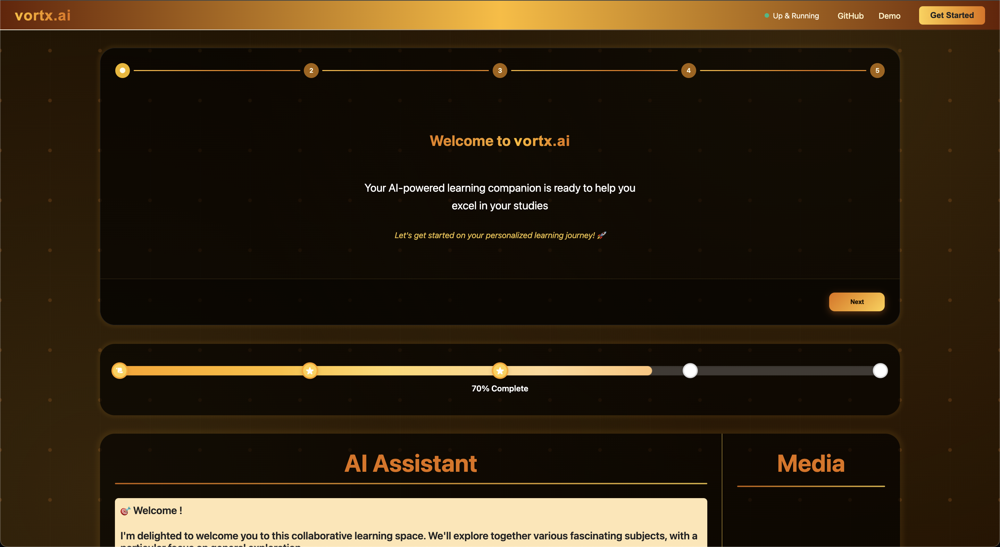
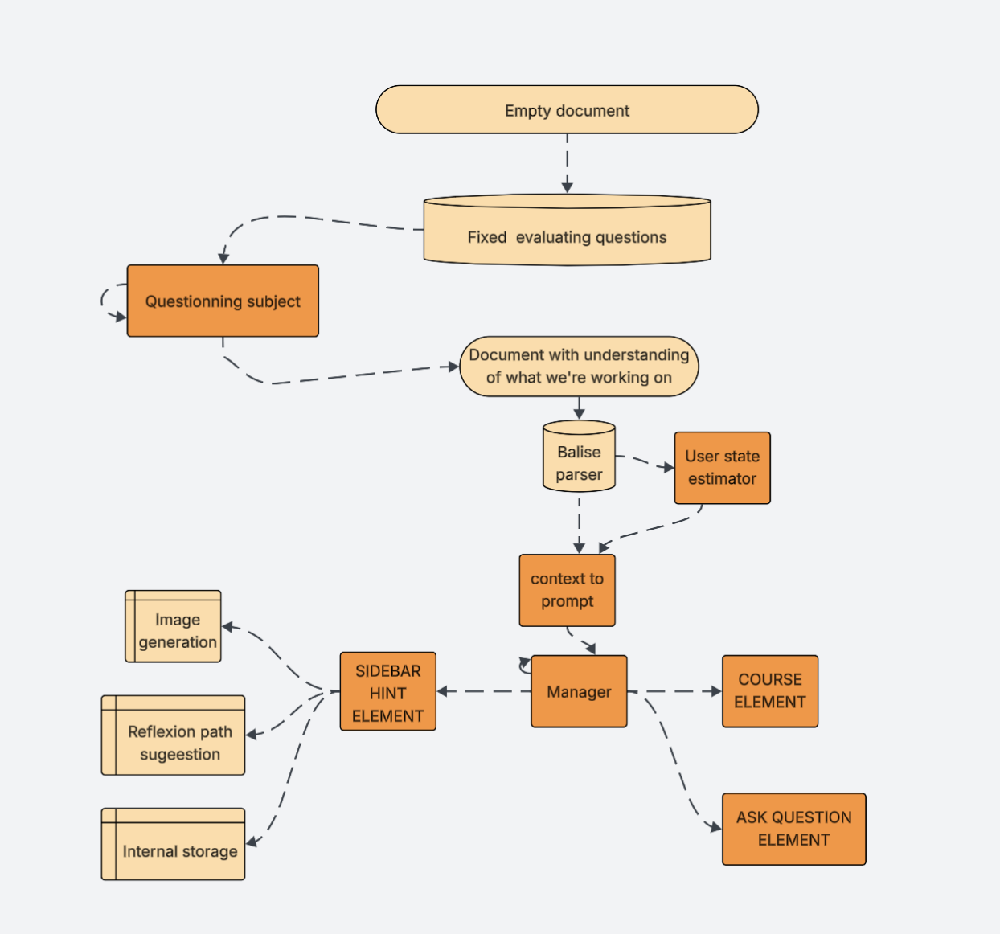

# vortx.ai

vortx.ai is an AI-powered assistant platform designed to help you connect your cloud, get help from the internet, and complete your tasks efficiently. Our mission is to streamline your workflow with intelligent automation and seamless integration. The platform features:

- **AI Assistant**: Interact with an intelligent assistant for learning, productivity, and automation.
- **Media Generation**: Visualize concepts and generate images or plots in real time.
- **Personalized Learning**: Tailor your experience by selecting subjects and topics of interest.
- **Modern UI**: Built with React and TypeScript for a beautiful, responsive user experience.
- **Backend**: Python Flask API for agent logic, media generation, and real-time updates.

<div style="display: flex">
    
    
</div>

## Project Structure

```
.
├── agent_workflow.png      # Example workflow image
├── example_image.png       # Main interface screenshot
├── backend/                # Python Flask backend
│   ├── api/                # API endpoints
│   ├── static/             # Static files
│   └── app.py              # Main application file
├── frontend/               # React frontend
│   ├── src/                # Source files
│   └── public/             # Public assets
├── .git/                   # Git version control
├── .gitignore              # Git ignore rules
├── .gitattributes          # Git attributes
├── LICENSE                 # License file
└── README.md               # This file
```

## Getting Started

1. **Clone the repository:**
   ```bash
   git clone https://github.com/yourusername/vortx.ai.git
   cd vortx.ai
   ```
2. **Install backend dependencies:**
   ```bash
   cd backend
   pip install -r requirements.txt
   ```
3. **Install frontend dependencies:**
   ```bash
   cd ../frontend
   npm install
   ```
4. **Run the backend:**
   ```bash
   cd ../backend
   python app.py
   ```
5. **Run the frontend:**
   ```bash
   cd ../frontend
   npm start
   ```

## How vortx.ai Works

vortx.ai is an adaptive AI-powered assistant designed to enhance learning, content creation, and productivity. The platform intelligently guides users through their journey by understanding their context and providing personalized support.

## Workflow Overview




#### Starting Point:
Users begin with an empty document or a set of fixed evaluation questions.


##### Context Building:
The system analyzes the user's input and questions to build a document with an understanding of what the user is working on. It uses a balise parser and a user state estimator to interpret the user's needs and current state.

#### AI-Driven Actions:
Based on this understanding, vortx.ai can:
Generate images and visual content
Suggest new learning or exploration paths
Store information for future use

#### User Interface Elements:
The assistant interacts with users through several UI components:
Sidebar Hint Element: Offers hints and suggestions
Course Element: Provides course-like explanations and content
Ask Question Element: Allows users to ask further questions
Central Manager:
A manager component coordinates all actions, ensuring users receive relevant prompts, hints, and content tailored to their context.

## License

This project is licensed under the MIT License. See the [LICENSE](LICENSE) file for details.
